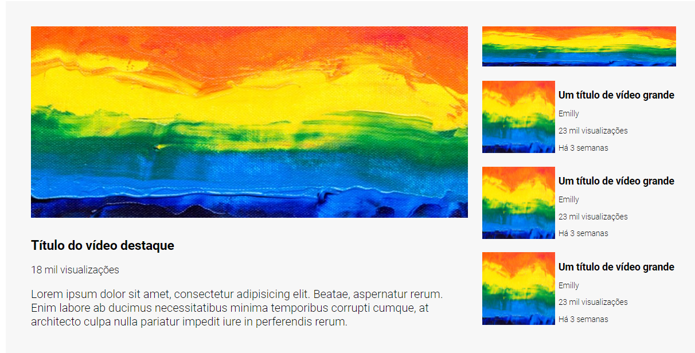

# Exercício HTML e CSS avançados ❗

## Layout YouTube com grid e flex 

Nesse desafio foi feita uma estrutura semelhante a do YouTube utilizando apenas HTML e CSS, onde as propriedades como Grid e Flex foram fundamentais. 
 
## Resultado ✔

